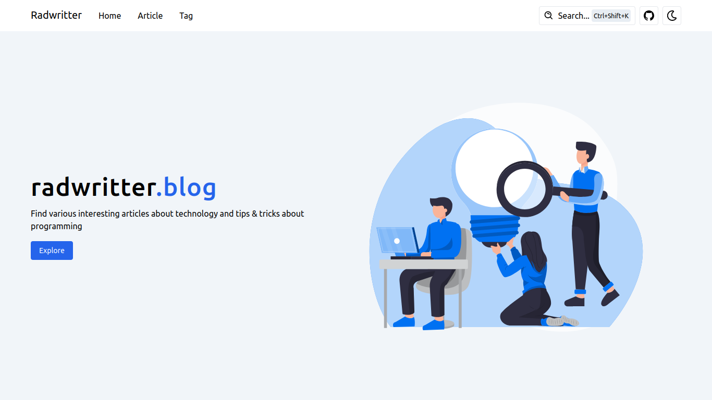

<!-- PROJECT LOGO -->
<div align="center">
  <h1 align="center">My Personal Blogs Website</h1>
  <p align="center">
    An awesome Blogs website!
    <br />
    <a href="https://radwritter.vercel.app/"><strong>View Demo »</strong></a>
  </p>
</div>



### Built With

This website using tech stack:

- React JS

- Tailwind Css

- Node JS

- Express JS

- MongoDB

- Vite

- Vercel

## Getting Started

Change what was mine into your project.

### Prerequisites

This is an example of how to list things you need to use the software and how to install them.

- Node JS

- Git

- NPM

- MongoDB

### Installation

1. Clone the repo
   ```sh
   git clone https://github.com/radityaseptian/blog.git
   ```
2. `cd blog/frontend`
3. Install NPM packages for frontend
   ```sh
   npm install
   ```
4. Running the program for frontend
   ```sh
   npm run dev
   ```
5. See running programs
   ```sh
   http://localhost:5173
   ```
6. `cd blog/backend`
7. Install NPM packages for backend
   ```sh
   npm install
   ```
7. Running the program for backend
   ```js
   node --watch index.js
   ```
8. Backend program running on `http:localhost:3000`
9. Create your `.env` file for backend, check example in `/backend/.env.example`

## Contact

Email: radityaseptian1551@gmail.com

Project Link: [https://github.com/radityaseptian/blog](https://github.com/radityaseptian/blog)
